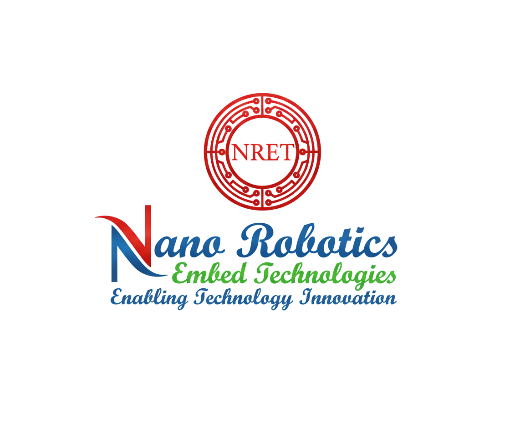

# Astrivix LMS - Next-Generation Ed-Tech Platform 🚀
*(Formerly Nano Robotics & Embed Technologies)*

## About Astrivix 🌟

Welcome to the updated version of our Learning Management System (LMS)! Astrivix is a comprehensive, next-generation ed-tech platform specializing in cutting-edge technology education. We provide an immersive learning experience with courses, hands-on projects, and exclusive internship opportunities in fields like Web Development, AI/ML, IoT & Robotics, Cybersecurity, UI/UX Design, and Cloud Computing.

Our mission is to bridge the gap between academic learning and industry requirements by offering practical, hands-on training programs designed by industry experts.

## Live Demo 🚀

**Live link:** [https://nano-robotics-embed-technologies.vercel.app](https://nano-robotics-embed-technologies.vercel.app)

---

## What's New in this Version? ✨

- **Revamped User Interface**: A stunning, responsive design with smooth animations and dynamic layouts.
- **Enhanced Dark/Light Mode**: Full support for seamless dark and light mode transitions across the entire platform.
- **Advanced Instructor Tools**: More powerful analytics, course creation flows, and content management.
- **Improved Performance**: Optimized lazy loading, efficient state management, and faster data fetching.

---

## Features 🎯

### For Students 👨‍🎓
- **Interactive Courses**: Browse and enroll in expert-led courses across multiple technology domains
- **Real-world Projects**: Access hands-on projects to build and showcase your portfolio
- **Internship Portal**: Apply directly for internship opportunities to gain industry experience
- **Progress Tracking**: Track your learning progress with intuitive visual indicators
- **Adaptive UI**: Toggle between dark and light themes for a comfortable viewing experience anywhere

### For Instructors 👨‍🏫
- **Course Management**: Create, update, and manage courses with a rich text editor and media support
- **Project Management**: Add and manage portfolio projects for students
- **Internship Listings**: Post exclusive internship opportunities directly to learners
- **Analytics Dashboard**: View insights, revenue, and metrics about your content and students

---

## Tech Stack 💻🔧

### Frontend 🎨
- **React.js** - A JavaScript library for building modern user interfaces
- **Vite** - Next-generation lightning-fast frontend tooling
- **Redux Toolkit** - Centralized state management
- **Tailwind CSS** - Utility-first CSS framework for rapid UI development
- **Framer Motion** - Powerful animation library for React
- **React Router** - Dynamic client-side routing

### Backend ⚙️
- **Node.js & Express.js** - Robust server-side architecture and RESTful APIs
- **MongoDB** - Flexible, highly scalable NoSQL database
- **JWT** - Secure, stateless authentication tokens
- **Cloudinary** - Efficient cloud-based media management and delivery

---

## System Architecture 🏰

Our platform follows a highly optimized client-server architecture:

### Frontend (Client)
Built with ReactJS, providing a highly responsive and dynamic user interface with features like:
- Intelligent lazy loading for optimal performance
- Skeleton loading states for smooth data fetching
- Complete Dark/Light mode support
- Mobile-first responsive design for all devices

### Backend (Server)
Built with NodeJS and ExpressJS, providing:
- Secure RESTful APIs for all platform functionalities
- Robust user authentication and role-based authorization (Admin, Instructor, Student)
- Comprehensive Course, Project, and Internship management systems
- Integrated media upload and secure management pipelines

---

## Key Modules 📄

### Public Exploration
- **Home** - Dynamic landing page with platform overview and featured content
- **Courses Catalog** - Advanced search and filtering of all available courses
- **Course Details** - In-depth course information, syllabus, and reviews
- **Projects & Internships** - Explore real-world applications and career opportunities
- **About** - Learn about Astrivix
- **Contact** - Get in touch with us

### Student Dashboard
- **Enrolled Courses** - Seamless access to purchased content and video player
- **Cart & Wishlist** - Manage course purchases and saved items
- **Purchase History** - Detailed view of past orders and receipts

### Instructor Dashboard
- **My Content** - Complete overview of created courses
- **Course Builder** - Step-by-step creation flow for adding modules and videos
- **Opportunity Management** - Dedicated sections for managing projects and internships

---

## Core Libraries Used 📚

- **Framer Motion** - Smooth page transitions and micro-interactions
- **React Hot Toast** - Elegant toast notifications
- **React Hook Form** - Performant, flexible, and extensible form management
- **React Dropzone** - Seamless drag-and-drop file uploads
- **Swiper** - Touch-friendly carousel and sliders
- **Type Animation** - Engaging typing text effects
- **Video React** - Comprehensive video player integration
- **Chart.js** - Beautiful data visualization for analytics

---

## Contact 📧

**Astrivix (Formerly NRET)**

- Website: [https://nano-robotics-embed-technologies.vercel.app](https://nano-robotics-embed-technologies.vercel.app)
- Email: contact@astrivix.in

---

Built with ❤️ for the future of learning

